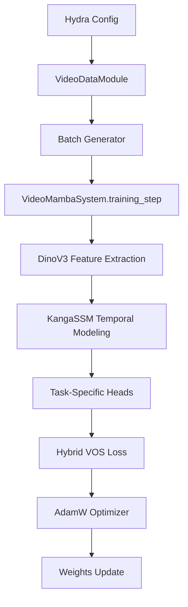
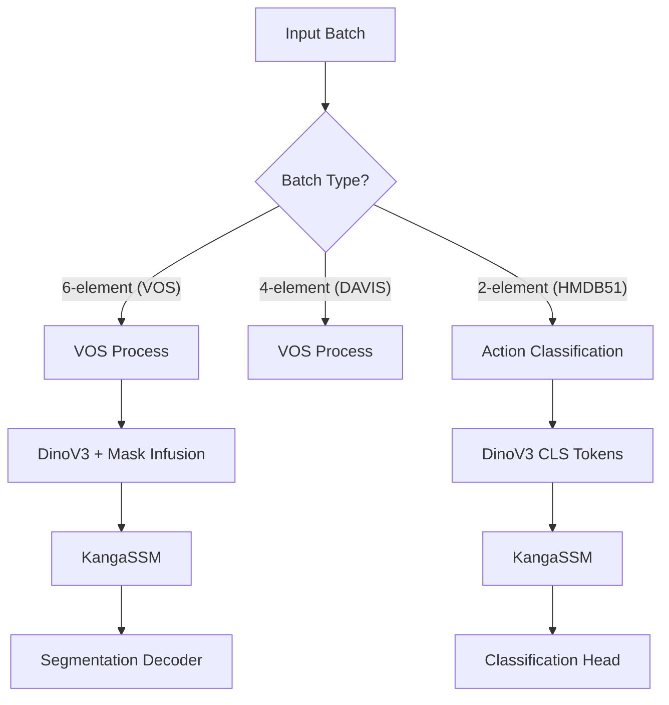

# Project Architecture - Video Mamba

This document provides a high-level overview of the Video Mamba project's architecture, designed for both human engineers and AI agents.

## Core Clusters

Based on the [GitNexus](https://github.com/abhigyanpatwari/GitNexus) modularity principles, the project is divided into the following clusters:

1.  **Data Pipeline Cluster** (`data/`): Handles dataset loading (DAVIS, HMDB51, YouTube-VOS) and PyTorch Lightning DataModules.
2.  **Model Architecture Cluster** (`models/`):
    -   **Backbone**: DinoV3 for spatial feature extraction.
    -   **Temporal Engine**: KAN-Modulated SSM (KangaSSM) for multi-frame contextualization.
    -   **Task Heads**: Specialized heads for Action Classification, Object Detection, and Segmentation.
3.  **Training & Configuration Cluster** (`configs/`, `train.py`): Hydra-driven orchestration of experiments.
4.  **Evaluation Cluster** (`eval/`, `utils/metrics.py`): Standalone evaluation logic and metrics.

## Principal Processes

### 1. Training Process
The flow from raw data to model updates.

### 2. Multi-Task Inference Process
How the model dispatches different tasks based on the input batch structure.

## Key Symbols for Agents

-   `VideoMambaSystem`: The central hub (LightningModule) that orchestrates the forward pass and loss computation.
-   `IntricateKANSSMCore`: The core mathematical engine where B and C matrices are modulated via KAN.
-   `MultiObjectVOSDataModule`: Specialized data loader for complex VOS tasks.
